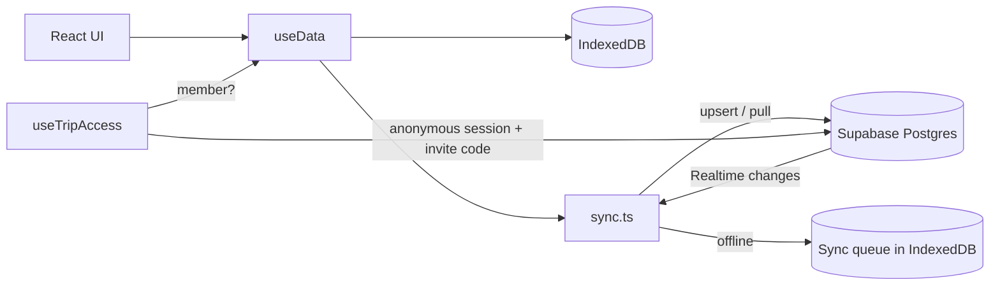

# Let's Travel (여행 가자!)

> An offline-first PWA that four friends used as a shared expense book on a trip to Prague and Budapest. It logs expenses in multiple currencies, syncs them in real time, and works out who owes whom with the fewest transfers.

## Features

- **Multi-currency expenses.** Enter amounts in EUR, CZK, HUF or KRW. Each one is converted to KRW with daily exchange rates from the [Frankfurter API](https://www.frankfurter.app/), cached per day, with fallback rates when offline.
- **Flexible splitting.** Split evenly among selected members, or use detailed mode to split a shared amount plus individual items.
- **Settlement.** Computes each member's balance and a greedy minimum-transfer settlement plan. Deposits, settlements and cash exchanges between members are tracked as transfers.
- **Offline-first sync.** All data lives in IndexedDB first. Changes are pushed to Supabase when online, queued while offline, and merged by `updated_at`. Other members' changes arrive through Supabase Realtime.
- **Wallet and stats.** Shows personal spending against a budget, cash on hand, and spending by category and city.
- **Installable PWA.** Includes a service worker, precaching, and a deferred reload so an update never interrupts data entry.

## Tech Stack

| Area | Tech |
|---|---|
| UI | React 19, TypeScript, Tailwind CSS 4, Konsta UI, dnd-kit |
| Build | Vite 6, vite-plugin-pwa (Workbox) |
| Local storage | IndexedDB (`idb`) |
| Backend | Supabase (Postgres, Row Level Security, Realtime, Anonymous Auth) |
| Tests | Vitest |

## Architecture



- The UI only reads from IndexedDB, so the app stays fully usable without a network.
- Sync starts only after the device has proven trip membership (see [Security](#security)).

## Security

The Supabase anon key ships in the client bundle, so the database has to protect itself.

- Each device signs in with **Supabase Anonymous Auth** and joins the trip once with an **invite code**.
- The invite code is stored only as a **bcrypt hash** in a table that clients cannot read. The `join_trip` RPC is a `SECURITY DEFINER` function that checks the code, rate-limits failed attempts (5 per user and 30 in total per 15 minutes, serialized with an advisory lock so parallel requests can't skip the limit), and adds the user to `trip_members`.
- RLS on `expenses`, `transfers` and `cash` allows access only to authenticated users for whom `is_trip_member()` is true. All privileges on those tables are revoked from the `anon` role. Realtime events follow the same RLS.
- The client caches membership only to skip a network round trip, for example when offline. The server still enforces every request.

The full policy is in [`supabase/security.sql`](supabase/security.sql).

## Getting Started

### Prerequisites
- Node.js 20+
- A Supabase project. Optional: without one, the app runs in local-only mode.

### Installation

```bash
git clone https://github.com/eden-chang/lets-travel.git
cd lets-travel
npm install
cp .env.example .env   # fill in your Supabase URL and anon key
npm run dev
```

### Supabase setup

1. In **SQL Editor**, run [`supabase/schema.sql`](supabase/schema.sql) and then [`supabase/security.sql`](supabase/security.sql).
2. In **Authentication → Sign In / Providers**, enable **Allow anonymous sign-ins**.
3. Set an invite code in the SQL Editor. Use a random string of 16+ characters (high entropy makes guessing infeasible even with many anonymous sessions) and never commit it:
   ```sql
   insert into public.trip_config (invite_code_hash)
   values (extensions.crypt('<long-random-code>', extensions.gen_salt('bf', 10)))
   on conflict (id) do update set invite_code_hash = excluded.invite_code_hash;
   ```
4. Share the code with trip members privately.
5. Optional hardening: enable CAPTCHA for sign-ins under **Authentication → Attack Protection**.
6. Verify that only the three `Trip members can access ...` policies exist:
   `select tablename, policyname from pg_policies where schemaname = 'public';`

## Environment Variables

| Variable | Description |
|---|---|
| `VITE_SUPABASE_URL` | Supabase project URL |
| `VITE_SUPABASE_ANON_KEY` | Supabase anon (public) key. It is safe to expose only because RLS is enforced |

## Scripts

| Command | Description |
|---|---|
| `npm run dev` | Start the dev server |
| `npm run build` | Production build (`dist/`) |
| `npm run preview` | Preview the production build |
| `npm test` | Run unit tests (Vitest) |

## Project Structure

```
src/
├── App.tsx              # Tab layout, member selection, access gate
├── components/          # Tabs (wallet, list, settle, transfer, stats), forms, InviteGate
├── hooks/
│   ├── useData.ts       # IndexedDB state + sync lifecycle
│   ├── useTripAccess.ts # Anonymous session + trip membership
│   └── useExchangeRates.ts
├── lib/
│   ├── access.ts        # Supabase auth / invite-code logic
│   ├── sync.ts          # Push, pull, offline queue, realtime
│   ├── idb.ts           # IndexedDB wrapper
│   └── exchange.ts      # Exchange rates with daily cache
├── logic.ts             # Settlement calculation
└── constants.ts         # Trip members, cities, categories
supabase/
├── schema.sql           # Tables, indexes, realtime publication
└── security.sql         # RLS policies, membership, invite-code RPC
```

## Customizing for Another Trip

Trip members, cities, dates and currencies are defined in [`src/constants.ts`](src/constants.ts).
